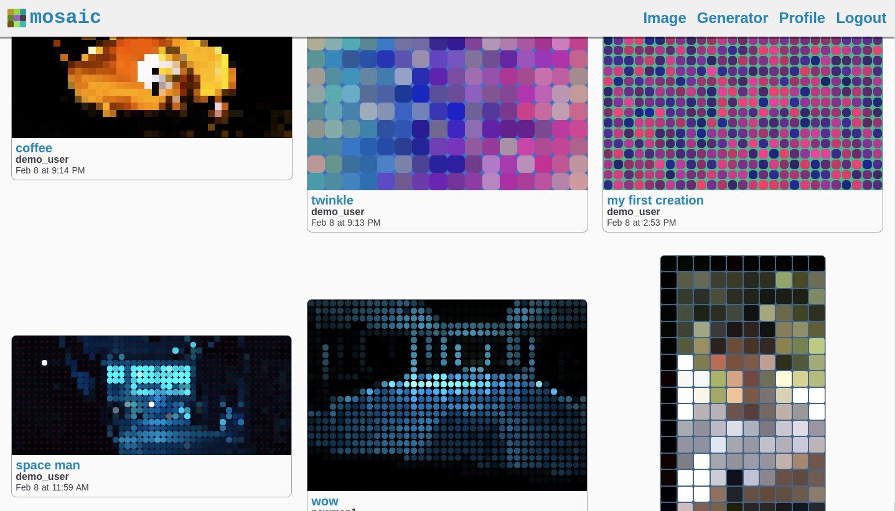

# [Mosaic](https://mosaiorama.herokuapp.com/)

Mosaic is a full stack webapp to create mosaic style components using either a reference image or randomly generated values.

## Users

Users are implemented using [JSON web tokens](https://jwt.io/).
On the backend, [Passport](https://github.com/jaredhanson/passport) verifies JWTs.
On the frontend, the JWT is stored in local storage (if 'Remember Me' is checked) or session storage (if 'Remember Me' is not checked).
Parsing the JWT allows the front end to get the current user's username and other data.
The user data is stored in a global store; the store is made from a combination of `createContext` and `useReducer`.

## Frontend

Built using React.js.

### Generators

The image generator and random generator heavily use the `useReducer` hook to simplify state management.
In particular, the random generator has 17 state variables controlled by it's reducer.

## Server

Built using Node.js, Express.js, and MongoDB.

### API

The REST API configures routes to retreieve data.
The user obtains a JWT from the login/register routes.
The JWT is then used to access the private app routes.

### Database

I started this project using PostgreSQL, but because of the structure of the pixel image data model, I switched the MongoDB.
MongoDB allows me to continue adding tools to the random/image generators without having to reconfigure my database.

## API Reference

### `/api/auth` (public)

Used for authentication and distributing JWT.

#### POST `/register`

- request: username and password
- reqponse:
  - success: username & "reigstration successful" message
  - error: username already exists

#### POST `/login`

- request: username and password
- repsonse:
  - success: username and jwt
  - error:
    - "Your username doesn't exist."
    - "Your password is invalid."

### `/api/app` (private: requires JWT)

These routes are for the random generator, image generator, homepage, and profile pages.

#### GET `/myprojects`

Gets a users projects and information

- reponse: query with id of user of whom to get projects
- response: user and user's data information

#### POST `/new`

Creates new project

- request: data for a new data entry
- reponse: new data id

#### PATCH `/update`

Updates projects after editing.

- request: data id and project information to update
- reponse: data id

#### GET `/recent`

Used for home page content.

- reponse: 18 most recent projects

### `/api/project` (private: requirest JWT)

These routes are for the page showing a single project, comments, and deleting projects.

#### GET `/`

Get the data of a specific project

- request: query with project id
- reponse: project data

#### DELETE `/delete`

Delete a project

- request: query with project id
- reponse: 200

#### POST `/comment`

Post a new comment for a project.

- request: project id and comment text
- reponse: new comment information

#### PATCH `/comment`

Edit a comment

- request: project id, comment id, and text
- reponse: updated comment data

#### DELETE `/comment`

Delete a comment

- request: project id and comment id
- reponse: 200

## Todo

- css animations
- quick sort over insertion sort
- sorting HSL
- custom sliders and other inputs
